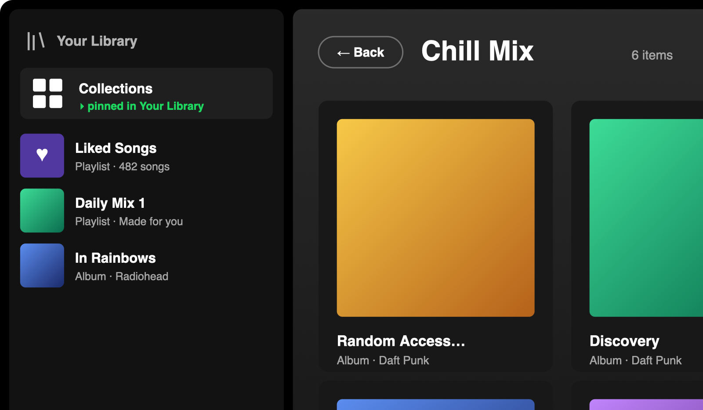

# Collections for Spotify

Group **albums and playlists** into named collections that live in their own
sidebar tab — *without* dumping every track into one big playlist. Each item
stays separate and clickable; open a collection and you get a grid of album/
playlist covers. Click a cover to jump to the real Spotify page.

Built as a [Spicetify](https://spicetify.app) custom app. Works on **macOS,
Windows, and Linux**.



*A collection open in the main view, with the **Collections** button pinned in
Your Library. (UI preview — album art and titles are placeholders.)*

## Spicetify Marketplace

Search **"Collections"** in the Marketplace. There are two builds:

- **Collections** (Extensions tab) — **one-click Install**, no GitHub/terminal.
  The UI opens as a full-screen overlay from the *Collections* button in Your
  Library (Esc or the back button closes it).
- **Collections (custom app)** (Apps tab) — a dedicated sidebar *tab/page* with
  native back/forward. Marketplace only *browses* custom apps, so install this
  one with the one-liner or installers below.

Both share the same saved data, so you can switch between them freely.

## Quick install (one line)

**macOS / Linux** — paste into a terminal:
```bash
bash <(curl -fsSL https://raw.githubusercontent.com/fletcherholt/album-collections/main/install-remote.sh)
```

**Windows** — paste into PowerShell:
```powershell
iwr -useb https://raw.githubusercontent.com/fletcherholt/album-collections/main/install-remote.ps1 | iex
```

These download the app from this repo, drop it into Spicetify's `CustomApps`,
register it, and run `spicetify apply`. (Spicetify + desktop Spotify must already
be installed.) Prefer a download instead? Use the zip + installers below.

## Install (run once)

First make sure [Spicetify](https://spicetify.app/docs/getting-started) and the
**desktop** Spotify app are installed (not the Microsoft Store / Snap-only build
where applicable). Then, for your OS:

**macOS** — double-click **`install.command`**.
- If macOS blocks it ("unidentified developer"): right-click → **Open** → **Open**.

**Windows** — double-click **`install.bat`**.
- It runs `install.ps1` with the execution policy bypassed for that one run.

**Linux** — run **`install.sh`** in a terminal:
```bash
chmod +x install.sh && ./install.sh
```
- Flatpak/Snap Spotify may need its path set once — the script links the
  [Spicetify Linux notes](https://spicetify.app/docs/advanced-usage/installation) if `apply` fails.

Spotify relaunches and a **Collections** button appears in **Your Library**
(alongside your playlists/albums), plus an icon in the top nav.

## Use

- Right-click any **album** or **playlist** → **Add to collection** → pick one
  (or create a new one in the same popup).
- Click **Collections** in Your Library → click a collection → grid of its items.
- Inside a collection, use **Sort by** to reorder the grid: date added (oldest/newest),
  name A–Z / Z–A, artist or creator A–Z / Z–A, release date (newest/oldest),
  genre A–Z, or type (albums first). Your choice is remembered.
- Hover an item → **✕** removes it from that collection.
- Click a cover to open the real album/playlist page. Spotify's back/forward
  buttons work normally (each view is a real route).
- The **✕**/Delete only affect the collection — your actual library is untouched.

## Uninstall

- **macOS:** double-click `uninstall.command`
- **Windows:** double-click `uninstall.bat`
- **Linux:** `./uninstall.sh`

(Your saved collections stay in Spotify's local storage and return if you reinstall.)

## What's inside

```
album-collections/
  manifest.json     sidebar name + icon; loads the context-menu extension at startup
  index.js          the Collections page (React via Spicetify.React, no JSX)
  contextmenu.js    "Add to collection" right-click item + Your Library button
install.command  /  uninstall.command    macOS (double-click)
install.bat      /  uninstall.bat        Windows (double-click → runs the .ps1)
install.ps1      /  uninstall.ps1         Windows PowerShell
install.sh       /  uninstall.sh          Linux / macOS (terminal)
```

All installers do the same thing: copy the app into Spicetify's `CustomApps`
folder (resolved per-OS), register it, and run `spicetify apply`.

Data is stored under the LocalStorage key `album-collections:v1`. Names + cover
art are fetched from Spotify's own Web API (via `Spicetify.CosmosAsync`), with a
fallback to the auth-free `open.spotify.com/oembed` endpoint so covers still load
on clients where the Web API is unavailable.

## Updating to a new version

There's no separate update step — **re-running the installer _is_ the update**.
It deletes the old copy, drops in the latest `main`, and re-applies (which
relaunches Spotify once). Your saved collections are untouched.

- **One-line / script install:** run the same install command again.
- **Spicetify Marketplace:** remove then reinstall Collections in the
  Marketplace tab to pull the new code (Marketplace doesn't auto-update apps).

The current version (e.g. `v1.4.0`) is shown next to the **Collections** title
inside the app, so you can tell at a glance whether you're up to date against the
latest [release](https://github.com/fletcherholt/album-collections/releases).

## Updating after a Spotify update

Spotify auto-updates sometimes wipe Spicetify. If the tab disappears, just run
the installer for your OS again (or `spicetify apply`).
